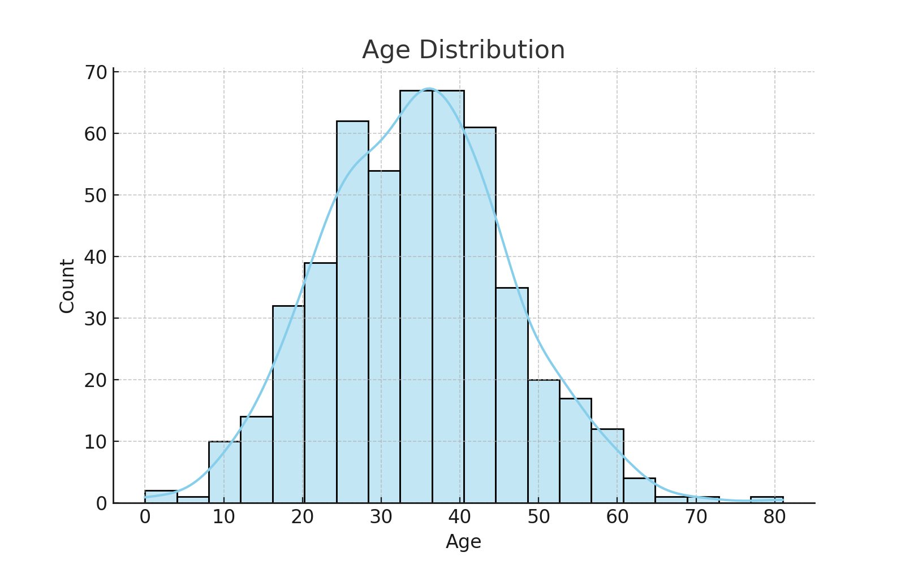
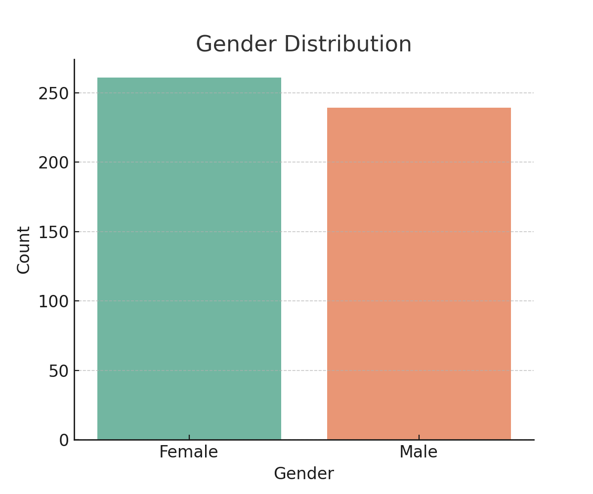

# Population Data Analysis

This project demonstrates **data cleaning** and **exploratory data analysis (EDA)** on a sample population dataset with **ages** and **genders**.

## 📂 Project Files
- `population_distribution.ipynb` → Jupyter Notebook with full analysis
- `population_cleaned.csv` → Cleaned dataset
- `age_distribution.png` → Histogram of Age Distribution
- `gender_distribution.png` → Bar chart of Gender Distribution

## 📊 Visualizations
### Age Distribution


### Gender Distribution


## 🚀 How to Run
1. Clone this repository  
2. Install dependencies  
   ```bash
   pip install pandas matplotlib seaborn
   ```
3. Open the Jupyter Notebook  
   ```bash
   jupyter notebook population_distribution.ipynb
   ```

## ✅ Insights
- Most of the population falls between **20 and 50 years old**  
- The gender ratio is roughly **balanced** (≈48% Male, 52% Female)
